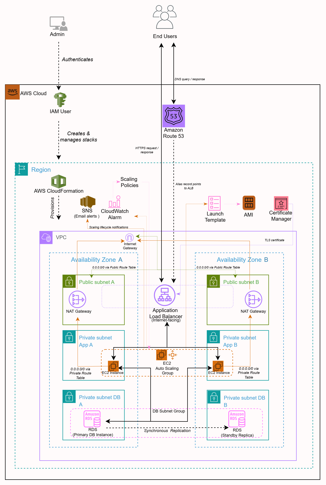
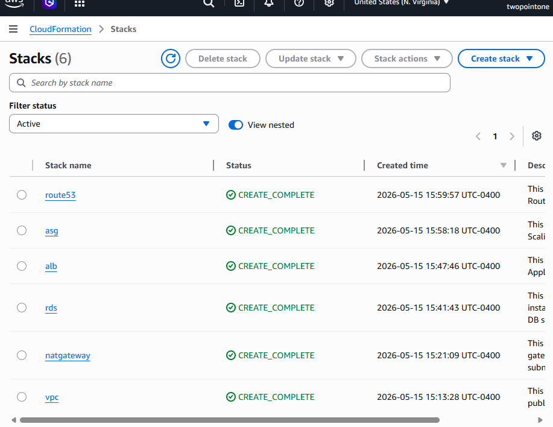
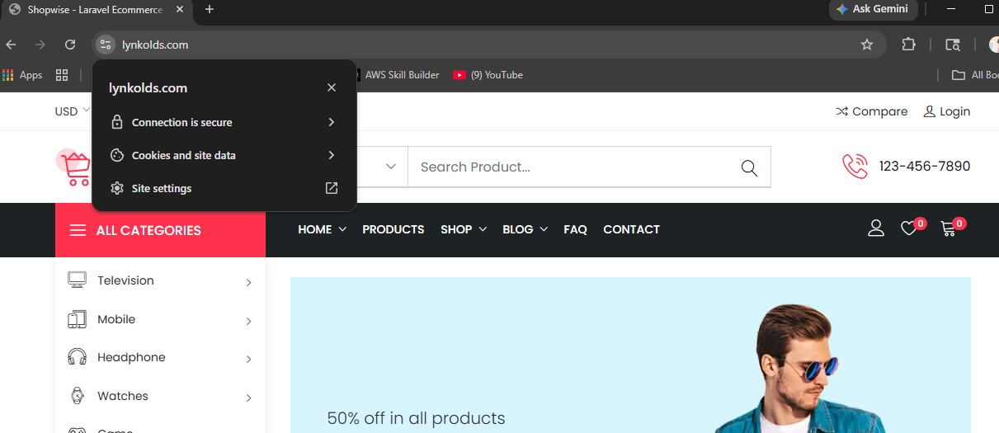
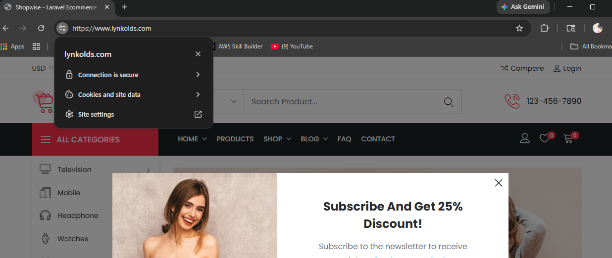

# Production-Ready AWS Dynamic Website Infrastructure Deployment with AWS CloudFormation

<a id="architecture-diagram"></a>



## Project Overview

This project provisions a production-style AWS infrastructure using AWS CloudFormation.

The architecture is modular, split into multiple stacks for flexibility and reuse. Each stack exports outputs that are consumed by downstream stacks using cross-stack references.

## Table of Contents

1. [Architecture Diagram](#architecture-diagram)
2. [Project Overview](#project-overview)
3. [Services and Technologies](#services-and-technologies)
4. [Key Characteristics](#key-characteristics)
5. [Request Flow](#request-flow)
6. [Infrastructure Components](#infrastructure-components)
7. [Networking Layout](#networking-layout)
8. [Repository Structure](#repository-structure)
9. [Stack Deployment Guide](#stack-deployment-guide)
10. [Deletion Order](#deletion-order)
11. [Notes & Best Practices](#notes--best-practices)
12. [Future Enhancements](#future-enhancements)

## Services and Technologies

- **Amazon VPC** — Provides the networking foundation
- **Public Subnets** — Host internet-facing resources such as the Application Load Balancer
- **Private Subnets** — Host application and database resources that should not be directly accessible from the internet
- **Security Groups** — Control inbound and outbound traffic between the load balancer, application servers, and database
- **Amazon EC2** — Runs the application servers
- **Amazon Machine Image (AMI)** — Provides the reusable server image for EC2 instances
- **EC2 Launch Template** — Defines the configuration used to launch EC2 instances
- **EC2 Auto Scaling** — Maintains application availability and adjusts capacity
- **Application Load Balancer (ALB)** — Distributes traffic and performs health checks
- **Amazon RDS** — Hosts the managed relational database
- **AWS CloudFormation** — Provisions and manages the infrastructure
- **Amazon CloudWatch** — Provides logs, metrics, and monitoring
- **Amazon SNS** — Delivers Auto Scaling notifications
- **Amazon Route 53** — Manages DNS routing
- **AWS Certificate Manager (ACM)** — Provides the TLS certificate for HTTPS


## Key Characteristics

- Uses an existing domain hosted in Amazon Route 53
- Uses an existing AWS Certificate Manager (ACM) certificate
- Restores the application database from an Amazon RDS snapshot
- Uses a custom AMI to launch EC2 application instances
- Uses EC2 Auto Scaling for application availability and capacity management
- Deploys public and private subnets across two Availability Zones for high availability
- Deploys the Application Load Balancer across public subnets
- Runs EC2 application instances in private subnets
- Places the RDS database in private subnets
- Uses security groups to restrict traffic between the ALB, EC2 instances, and RDS database
- Prevents direct internet access to application servers and the database
- Routes application traffic through the Application Load Balancer
- Enforces HTTPS by redirecting HTTP traffic to HTTPS
- Automatically configures Route 53 DNS routing to the Application Load Balancer
- Makes the application accessible through its domain after the Route 53 stack is deployed

## Request Flow

Users<br>
  ↓<br>
Route 53 (DNS)<br>
  ↓<br>
Application Load Balancer (HTTPS via ACM)<br>
  ↓<br>
Auto Scaling Group (EC2 Instances)<br>
  ↓<br>
RDS Database (Restored from Snapshot)<br>

## Infrastructure Components

#### Networking
- VPC with public and private subnets
- Internet Gateway
- NAT Gateways
#### Compute
- Auto Scaling Group (EC2 using custom AMI)
#### Database
- RDS instance restored from snapshot
#### Load Balancing
- Application Load Balancer (HTTPS via ACM)
#### DNS
- Route 53 domain routing

## Networking Layout
- 1 VPC (DNS enabled)
- 2 Public Subnets (ALB, NAT)
- 2 Private App Subnets (EC2)
- 2 Private DB Subnets (RDS)
#### Route Tables
- 1 Public route table
- 2 Private route tables (1 per AZ)

### Cross-Stack Referencing
Stacks communicate using exports and imports.
- Example:
 ```
   ExportVpcStackName = vpc
```

Upstream stack → exports values (e.g., VPC ID)

Downstream stack → imports via parameters
## Repository Structure

```
project-root/
├── cf-templates/           # CloudFormation templates
├── images/                 # Architecture diagram and screenshots
```

## Stack Deployment Guide

### Deployment Order

The `cf-templates/` folder in this repository contains the CloudFormation templates for the infrastructure.

Stacks must be deployed in the following order:
- VPC
- NAT Gateway
- RDS (Snapshot)
- ALB
- ASG
- Route 53

### 1. VPC Stack
Creates:
- VPC
- Public & private subnets
- Internet Gateway
- Route tables
- Security groups
  
Steps
- Save template as vpc.yaml
- Create stack: vpc
- Fill parameters
- Deploy

#### Notes
- Outputs are exported for reuse
- Metadata organizes parameters

### 2. NAT Gateway Stack
Creates:
-NAT Gateway for private subnet internet access

Steps
- Save as natgateway.yaml
- Create stack: natgateway
```
Parameter:
ExportVpcStackName = vpc
```

### 3. RDS Stack (Snapshot-Based)
Creates:
- RDS instance restored from snapshot
  
Steps
- Save as rds-snapshot.yaml
- Create stack: rds-snapshot
- Provide:
 ```
  Snapshot ARN
   ExportVpcStackName = vpc
  ```

#### Notes
- Credentials are inherited from the snapshot
- A new DB endpoint is generated
- The ALB, ASG, and Route 53 stacks can be deployed immediately after the RDS stack enters the `CREATE_IN_PROGRESS` state to reduce overall deployment time, since RDS provisioning typically takes the longest.

### 4. Application Load Balancer Stack
Creates:
- Public ALB
- HTTPS listener
  
Steps
- Save as alb.yaml
- Create stack: alb
- Provide:
  ExportVpcStackName = vpc
  CertificateArn     = <ACM ARN>

### 5. Auto Scaling Group Stack
Creates:
- Launch Template
- Auto Scaling Group
- EC2 instances (custom AMI)
- CloudWatch Alarm
- SNS Topic
  
Steps
- Save as asg.yaml
- Create stack: asg
- Provide:
 ```
  ExportVpcStackName         = vpc
  ExportAlbStackName         = alb
  EC2KeyName                 = <key pair>
  EC2ImageID                 = <custom AMI>
  WebServerLaunchTemplateName= <name>
  InstanceType               = t3.micro (recommended)
  OperatorEmail              = <email>
```

### 6. Route 53 Stack
Creates:
- A record → ALB DNS
  
Steps
- Save as route-53.yaml
- Create stack: route53
- Provide:
  ```
  ExportAlbStackName = alb
  DomainName         = your-domain-name
  ```


### Important Deployment Setting
#### Disable Rollback (For Debugging Only)

During troubleshooting, you can disable CloudFormation rollback to:

- Prevent automatic deletion of failed resources
- Inspect failed resources and stack events
- Debug configuration or dependency issues more easily

Note: Rollback should normally remain enabled in production environments.

### 7. Access Application
https://yourdomainname



https://www.yourdomainname




## Deletion Order
Delete stacks in reverse order:
- Route 53
- ASG
- ALB
- RDS
- NAT Gateway
- VPC
- _Empty and delete the temporary Amazon S3 bucket used to store the CloudFormation template files._

## Notes & Best Practices
- Use modular stacks for flexibility and reuse
- Avoid hardcoding values (domains, ARNs, etc.)
- Use exports/imports for clean dependencies
- Keep compute and databases in private subnets
- Prefer modern instance types (e.g., t3.micro)
- Use RDS snapshots to accelerate provisioning

## Future Enhancements
- Integrate Secrets Manager for secure credentials
- Add CI/CD for automated deployments
- Migrate to Terraform for centralized state management
